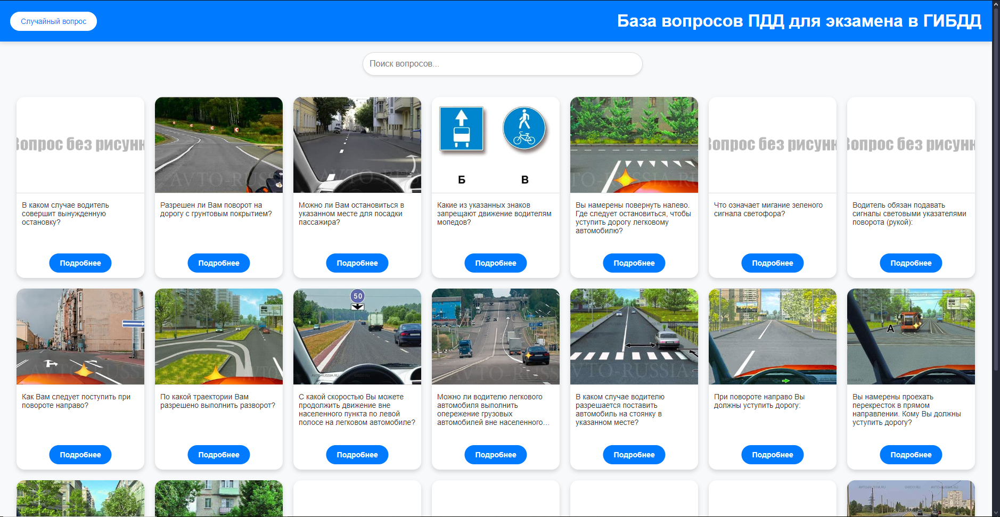

# PDD Parser & Web Server

## Описание проекта
Этот проект представляет собой парсер билетов по правилам дорожного движения (ПДД) и веб-приложение для их отображения.  
Он включает:
1. **Парсер (`parser.py`)**: Загружает данные с сайта, включая вопросы, изображения, правильные ответы и пояснения, и сохраняет их в базу данных SQLite.
2. **Веб-сервер (`server.py`)**: Поднимает сайт с помощью фреймворка Flask и отвечает за генерацию ответов на запросы и связь между фронтендом и базой данных.
3. **Главный файл (`main.py`)**: Запускает парсер и веб-сервер, и наблюдает за их состоянием. В случае завершения работы любой из программ, завершает остальные программы, что позволяет Docker в тот же момент перезапустить весь контейнер.
4. **Страницы (`index.html`) и (`ticket.html`)**: Главная страница и страница вопроса соответственно.

Проект упакован в контейнер Docker и автоматически перезапускается при сбое.

---

## Последовательность запуска.

### 1. Убедитесь, что у вас установлен Docker, а Docker Engine запущен.

### 2. Склонируйте репозиторий:
#### Для клонирования из ветки main:
```bash
git clone https://github.com/achr1hr/PDD_questions_base.git
```
#### Для клонирования из ветки dev:
```bash
git clone https://github.com/achr1hr/PDD_questions_base.git -b dev
```
### 3. Запустите build.sh.
```bash
.\build.sh
```
### 4. Зайдите на http://localhost:7777

## Функционал
### С помощью данного сайта можно смотреть билеты для экзамена в ГИБДД.
### Главная страница данного сайта должна выглядеть так:

### Чтобы открыть любой из билетов, нужно нажать на кнопку "Подробнее". После нажатия на кнопку "Подробнее" вы попадёте на страницу билета. Она выглядит так:

### На данной странице есть изображение, связанное с вопросом, описание вопроса, правильный ответ и пояснение к ответу. Чтобы вернуться на главную страницу нужно нажать "Вернуться к списку вопросов".

### Также, на главной странице в левом верхнем углу есть кнопка "Случайный вопрос". При нажатии на неё вас переадрессует на абсолютно случайный вопрос. 
### На странице присутствует поисковая строка. При вводе в неё названия любого вопроса, отображение вопросов будет динамически меняться в соответствии с запросом и в конце ввода запроса будут отображаться наиболее подходящие варианты.
## Приятного пользования
